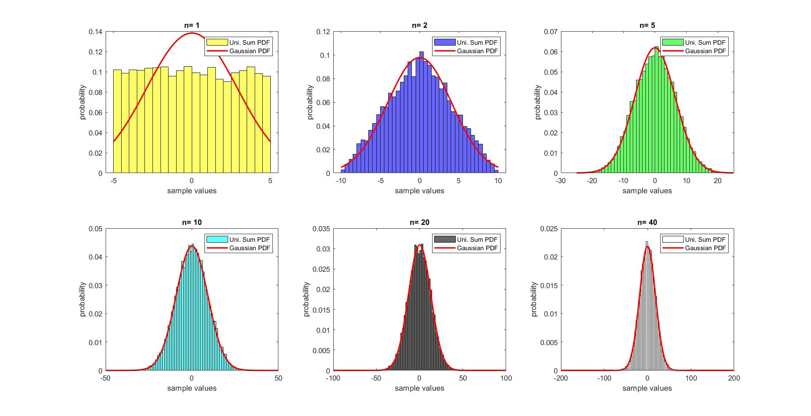

# Observation on the Implication of Central Limit Theorem

This simple project is designed to observe the implication of [Central Limit Theorem](https://en.wikipedia.org/wiki/Central_limit_theorem) on probability distributions. The project consists of several experiments on sums of [independent and identically distributed random variables](https://en.wikipedia.org/wiki/Independent_and_identically_distributed_random_variables) (IID).

The Central Limit Theorem is stated as follows:

Given , a sequence of IID random variables with expected value  and variance , the CDF of }}) has the property =\Phi\left(z\right).)

Briefly, the theorem implies that: As n increases, the sum of n IID random variables converges to a [Gaussian Distribution](https://en.wikipedia.org/wiki/Normal_distribution). 

Following four experiments with four different probability functions designed to show the sums converges to Gaussian indeed. The probability functions used in these experiments specified below:

1st experiment: [Uniform R.V.](https://en.wikipedia.org/wiki/Continuous_uniform_distribution)

2nd experiment: [Exponential R.V](https://en.wikipedia.org/wiki/Exponential_distribution)

3rd experiment: [Bernoulli R.V](https://en.wikipedia.org/wiki/Bernoulli_distribution)

4th experiment: [Poisson R.V.](https://en.wikipedia.org/wiki/Poisson_distribution)

For all experiments, 1000 samples of random sums   are generated for corresponding n values. Then, they are normalized and shown on a histogram. n values used in these experiments are chosen 1, 2, 5, 10, 20, 40 for demonstration purposes. The resulting histograms are plotted with a Gaussian probability distribution function ([PDF](https://en.wikipedia.org/wiki/Probability_density_function)) or Gaussian cumulative distribution function ([CDF](https://en.wikipedia.org/wiki/Cumulative_distribution_function)) according to the context of the experiment.

Scripts of the experiments are given in the repository.

The results of the experiments are below. As n increases, the sums are observed to converge to the corresponding Gaussian CDF/ PDF.

